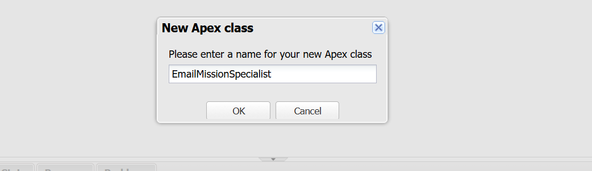
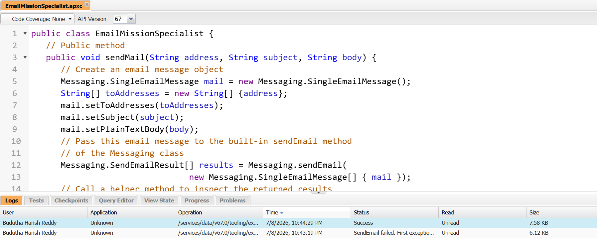
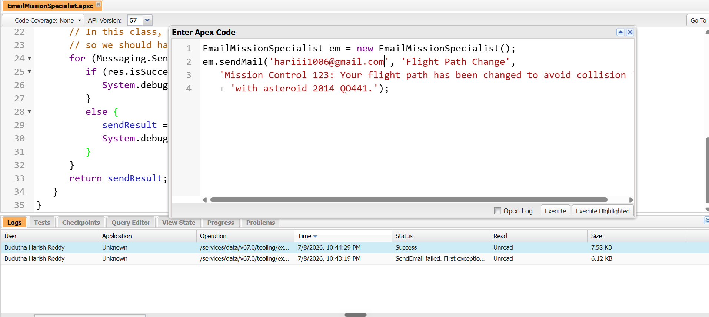
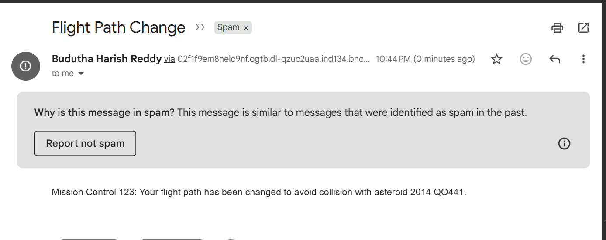
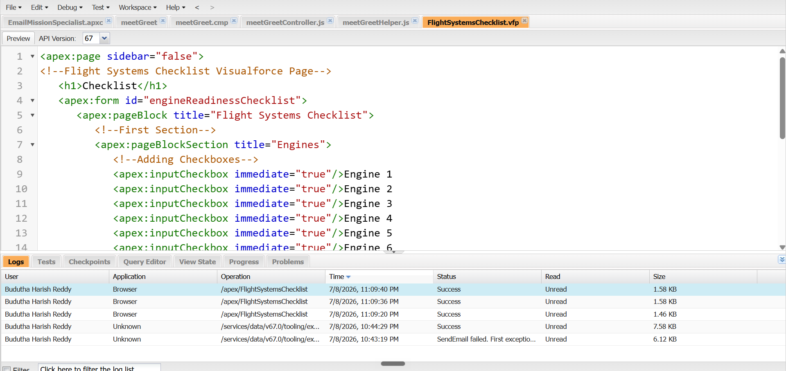
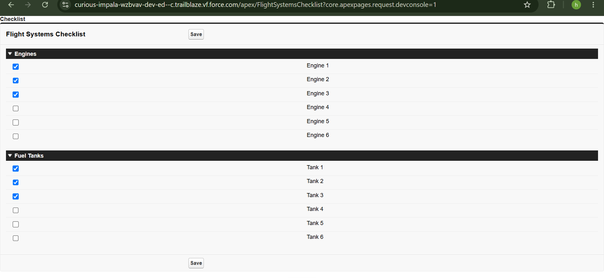

# Apex Basics – Navigate and Edit Source Code

A hands-on walkthrough of the Salesforce Trailhead unit **"Navigate and Edit Source Code,"** completed in the Developer Console. This project covers writing and executing an Apex class, creating an Aura Lightning component, and building a Visualforce page.

**Author:** Budutha Harish Reddy

---

## What This Covers

- ✅ Creating and saving an Apex class
- ✅ Executing Apex code with Execute Anonymous
- ✅ Sending an email from Apex using the `Messaging` class
- ✅ Creating an Aura Lightning component
- ✅ Building and previewing a Visualforce page

---

## Step 1: Create the Apex Class

Created a new Apex class named `EmailMissionSpecialist` via **File | New | Apex Class** in the Developer Console.



The class defines a `sendMail` method that builds a `Messaging.SingleEmailMessage`, sends it through `Messaging.sendEmail()`, and inspects the results via a private helper method.

```apex
public class EmailMissionSpecialist {
   public void sendMail(String address, String subject, String body) {
      Messaging.SingleEmailMessage mail = new Messaging.SingleEmailMessage();
      String[] toAddresses = new String[] {address};
      mail.setToAddresses(toAddresses);
      mail.setSubject(subject);
      mail.setPlainTextBody(body);

      Messaging.SendEmailResult[] results = Messaging.sendEmail(
                                new Messaging.SingleEmailMessage[] { mail });
      inspectResults(results);
   }

   private static Boolean inspectResults(Messaging.SendEmailResult[] results) {
      Boolean sendResult = true;
      for (Messaging.SendEmailResult res : results) {
         if (res.isSuccess()) {
            System.debug('Email sent successfully');
         } else {
            sendResult = false;
            System.debug('The following errors occurred: ' + res.getErrors());
         }
      }
      return sendResult;
   }
}
```

Saved via **File | Save** — the Developer Console validated the class with no errors, confirmed by the `Success` log entry.



---

## Step 2: Execute the Apex Class

Used **Debug | Open Execute Anonymous Window** to run the class against a real email address.



```apex
EmailMissionSpecialist em = new EmailMissionSpecialist();
em.sendMail('your-email@example.com', 'Flight Path Change',
   'Mission Control 123: Your flight path has been changed to avoid collision '
   + 'with asteroid 2014 QO441.');
```

Clicking **Execute** confirmed the code runs successfully and dispatches the email.



---

## Step 3: Create an Aura Lightning Component

Created a Lightning component bundle named `meetGreet` via **File | New | Lightning Component**, adding a simple greeting markup inside `<aura:component>` tags:

```html
<p>Greetings, fellow humans! What's your status?</p>
```

The Developer Console generates the full bundle (`.cmp`, controller, and helper resources), all accessible as separate tabs.



---

## Step 4: Create a Visualforce Page

Built a `FlightSystemsChecklist` Visualforce page with two sections — **Engines** and **Fuel Tanks** — each containing checkboxes, plus a **Save** button.

```html
<apex:page sidebar="false">
   <h1>Checklist</h1>
   <apex:form id="engineReadinessChecklist">
      <apex:pageBlock title="Flight Systems Checklist">
         <apex:pageBlockSection title="Engines">
            <apex:inputCheckbox immediate="true"/>Engine 1
            <apex:inputCheckbox immediate="true"/>Engine 2
            <apex:inputCheckbox immediate="true"/>Engine 3
            <apex:inputCheckbox immediate="true"/>Engine 4
            <apex:inputCheckbox immediate="true"/>Engine 5
            <apex:inputCheckbox immediate="true"/>Engine 6
         </apex:pageBlockSection>
         <apex:pageBlockSection title="Fuel Tanks">
            <apex:inputCheckbox immediate="true"/>Tank 1
            <apex:inputCheckbox immediate="true"/>Tank 2
            <apex:inputCheckbox immediate="true"/>Tank 3
            <apex:inputCheckbox immediate="true"/>Tank 4
            <apex:inputCheckbox immediate="true"/>Tank 5
            <apex:inputCheckbox immediate="true"/>Tank 6
         </apex:pageBlockSection>
         <apex:pageBlockButtons>
            <apex:commandButton value="Save" action="{!save}"/>
         </apex:pageBlockButtons>
      </apex:pageBlock>
   </apex:form>
</apex:page>
```

Previewed the page directly from the Developer Console (**Preview** button), confirming the checkboxes render and toggle correctly.



---

## Key Takeaways

- The **Developer Console** is a full IDE for Apex, Aura components, and Visualforce — all in the browser, no local setup needed.
- **Execute Anonymous** is a fast way to test Apex logic without deploying a trigger or button.
- **Aura components** and **Lightning Web Components** can coexist in the same org.
- **Visualforce** is page-centric (server round-trip on submit), unlike client-side Lightning components.

---

## Tech Stack

`Apex` · `Aura Components` · `Visualforce` · `Salesforce Developer Console`
